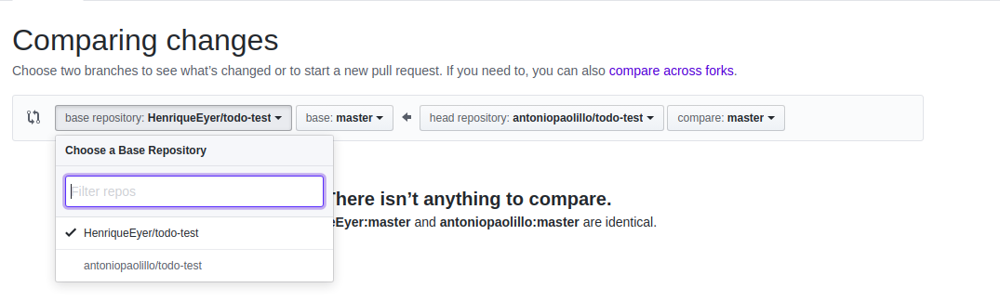
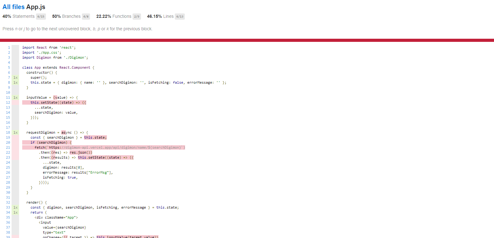

# Boas-vindas ao exercício Digimon Finders

---

# Orientações

  
<strong>‼️ Antes de começar a desenvolver</strong>
 

- Crie um fork desse projeto. Para isso, siga este [tutorial de como realizar um fork](https://guides.github.com/activities/forking/).

- Após fazer o fork, clone o repositório criado em seu computador.

- Rode o `npm install`.

- Vá para a branch master de seu projeto e execute o comando `git branch`.

- Mude para a branch digimon-finders com o comando git checkout -b digimon-finders. É nessa branch que você realizará a solução para o exercício.

- Observe o que deve ser feito nas instruções.

 

  
<strong>🤝 Depois de terminar o desenvolvimento</strong>
 

- Após a solução dos exercícios, abra um PR em seu repositório forkado e, se quiser, mergeie para a master.

⚠ **Atenção!** Quando for criar o PR, você se deparará com a seguinte tela:

- É necessário realizar uma mudança. Clique no *base repository*, assim como na imagem a seguir.

- Mude para seu repositório. Seu nome estará na frente do nome dele, por exemplo: `antonio/comprehension-exercises`. Depois desse passo, a página deverá ficar assim:

- Agora basta criar o PULL REQUEST clicando no botão `Create Pull Request`.

➡ Para cada PR realize esse mesmo processo.

 

  
<strong>👨‍💻 O que deverá ser desenvolvido</strong>
 

Este repositório contém uma aplicação funcional, que utiliza a [Digimon API](https://digimon-api.vercel.app/) e pesquisa digimons pelo nome.

Seu objetivo, nesse exercício, é utilizar todos os aprendizados a respeito de testes para alcançar 100% de cobertura de testes.

> 👀 **De olho na dica**: você pode verificar a cobertura de testes utilizando o comando `npm run test-coverage`, que te retornará um relatório parecido com o que é mostrado a seguir.

- A seta azul mostra o local em que deve estar o valor de 100, o que indica a finalização do exercício com todas as linhas do código testadas.

- Para implementar seus testes, edite os arquivos `./tests/Search.test.tsx` e `./tests/Routes.test.tsx`, que se encontram dentro da pasta src na raiz do projeto.

- Ler, entender a aplicação e saber o que testar também são partes do exercício.

- Atente aos logs que são recebidos ao rodar os testes! Logo abaixo há mais instruções de como saber o que está sendo testado ou não.

 

  
<strong>🛠️ Executando os testes</strong>
 

- Ao rodar o comando `npm run test-coverage`, será gerada uma nova pasta na raiz de seu projeto chamada `coverage`. Após criar a pasta, abra o arquivo `./coverage/lcov-report/index.html` usando a extensão `Live Server` de seu VSCode:

- Clique no link do arquivo `./coverage/lcov-report/index.html` e observe os detalhes sobre o que está sendo avaliado na cobertura de testes.

- Utilize essa lista como referência para programar seus testes. Cubra todas as linhas destacadas para ter 100% de cobertura!

### Testando os testes

"Testar testes" pode parecer um conceito estranho, mas existem técnicas bastante engenhosas para isso. A técnica utilizada aqui no exercício baseia-se em inserir vários bugs nos arquivos do projeto e verificar se os testes que você programou continuam a rodar ou apontam as falhas. Caso os testes não percebam os bugs, significa que estão acusando falsos positivos (ou negativos também).

Esses bugs são chamados de "mutantes", e sua missão aqui é eliminá-los! Você pode até pensar nisso como um joguinho e, para que tudo seja feito de maneira controlada, utilize uma library chamada [Stryker](https://stryker-mutator.io/).

O Stryker vai gerar os mutantes automaticamente de acordo com a configuração passada a ele, geralmente em um arquivo `JS`, também pode ser em um `JSON`. Se você acessar a raiz do exercício, encontrará o arquivo `stryker.conf.json`. Abra-o e dê uma espiada! Se você tiver curiosidade em relação a como funcionam as configurações, poderá acessar seu repositório e ler o [README](https://github.com/stryker-mutator/stryker/tree/master/packages/core#readme).

### Como usar o Stryker?

Usar o Stryker é fácil: basta rodar o comando `npx stryker run` nos projetos que o têm configurado. Você pode também instalá-lo de forma global usando o comando `npm install -g stryker-cli`.

 

**Divirta-se codando!** 🚀

---

# Exercícios

## Exercício 1 - Realize os testes das rotas da aplicação

Implemente os testes no arquivo `./src/tests/Routes.test.tsx`. O objetivo é garantir que as rotas estão funcionando da maneira esperada.

**Dica**: Lembre-se de criar o *helper* `renderWithRouter`.

  
Testes que deverão ser feitos: 

1. Teste que a aplicação renderiza corretamente em seu estado inicial:
   1. A página deverá apresentar o título "Search Digimon".
   2. A página deverá apresentar os links "About" e "Search Digimon".
2. Ao clicar no link `About`, a pessoa usuária é direcionada para a página `About`. Teste se o título "About" será renderizado na tela.
3. Ao tentar acessar uma rota inexistente, a pessoa usuária é direcionada para a página `Not Found`. Teste se os elementos da página `Not Found` estarão presentes.

## Exercício 2 - Realize os testes da busca por Digimon

Implemente os testes no arquivo `./src/tests/Search.test.tsx`. O objetivo é garantir que a lógica da busca por um Digimon, que está na rota `/`, funciona corretamente.

**Dica**: Lembre-se de criar `mocks` para testar o retorno da *API*.

  
Sugestão de testes: 

1. É possível inserir um valor na caixa de busca.
2. A tela inicia sem nenhum Digimon renderizado. Para esse teste, você pode testar que o `data-testid=digimonName` não está na tela.
3. É possível buscar um Digimon com sucesso.
4. A mensagem de erro é renderizada caso o Digimon buscado não exista.
5. A aplicação não realiza `fetch` caso a busca seja feita com o *input* vazio.

## Exercício 3 - Bônus - Consiga 100% de Cobertura e Stryker Passando

Neste exercício, você vai usar dois comandos para "testar seus testes":

- `npm run test-coverage` para verificar se a cobertura dos testes está em 100%.
- `npx stryker run` para usar a biblioteca Stryker para "testar seus testes".

Se você fizer todos os testes dos exercícios anteriores, ainda assim não conseguirá 100% de cobertura.
Isso porque não foi testado o caso de "erro de servidor" na requisição da API. Você deverá fazer este teste:

- Teste um erro de servidor:
  - Para isso, você deverá mockar o fetch com uma [Promise Rejeitada](https://jestjs.io/docs/mock-function-api#mockfnmockrejectedvaluevalue).
  - Faça o mock do `console.log` para verificar se a mensagem aparecerá no console quando houver erro de servidor.
  - Teste se o `console.log` recebe exatamente a frase de erro como argumento.
  - Dica: como o comportamento do mock é assíncrono, você pode utilizar o `waitFor` para envolver os `expects` do `console.log`.
